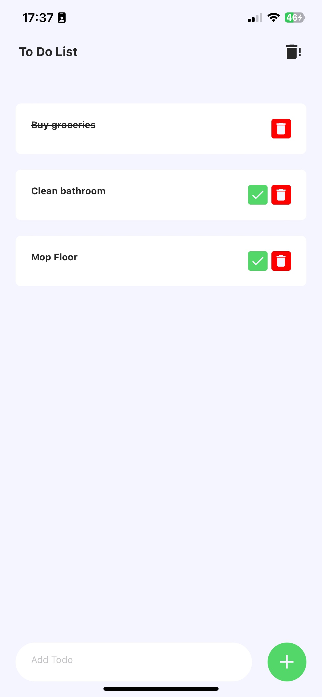

# To Do (React Native)

<p align="center">
  
</p>

## About the Project

React Native To Do application created for learning purposes.

You can add tasks, delete them and mark as done. All tasks will be saved in the local storage.

### Built With

- Expo
- React Native

## Installation and Usage

```
npm install
```

To make the pre-commit hook work, you need to run `npm install` when the project is already initialized as a Git repository.

If the project is initialized as a repository later, you need to additionally execute `npx expo prebuild`.

```
npx expo start
```

## Contact

Amri Mursyid Bin Mohd Zaini
Email: amrimmz@sunway.com.my
